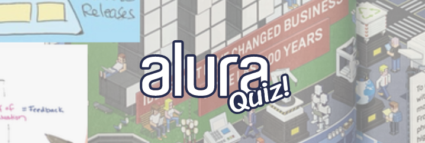

<!--
*** Thanks for checking out the Best-README-Template. If you have a suggestion
*** that would make this better, please fork the repo and create a pull request
*** or simply open an issue with the tag "enhancement".
*** Thanks again! Now go create something AMAZING! :D
-->


<!-- PROJECT SHIELDS -->
<!--
*** I'm using markdown "reference style" links for readability.
*** Reference links are enclosed in brackets [ ] instead of parentheses ( ).
*** See the bottom of this document for the declaration of the reference variables
*** for contributors-url, forks-url, etc. This is an optional, concise syntax you may use.
*** https://www.markdownguide.org/basic-syntax/#reference-style-links
-->
[![Contributors][contributors-shield]][contributors-url]
[![Forks][forks-shield]][forks-url]
[![Stargazers][stars-shield]][stars-url]
[![Issues][issues-shield]][issues-url]
[![MIT License][license-shield]][license-url]
[![LinkedIn][linkedin-shield]][linkedin-url]


<!-- PROJECT LOGO -->
<br />
<p align="center">
  <a href="https://github.com/kibolho/aluraquiz-abilioazevedo">
    
  </a>

  <h3 align="center">Alura Quizzes</h3>

  <p align="center">
    Next.JS quizzes application.
    <br />
    <a href="https://github.com/kibolho/aluraquiz-abilioazevedo"><strong>Explore the docs »</strong></a>
    <br />
    <br />
    <a href="https://quiz.abilioazevedo.com.br">View Demo</a>
    ·
    <a href="https://github.com/kibolho/aluraquiz-abilioazevedo/issues">Report Bug</a>
    ·
    <a href="https://github.com/kibolho/aluraquiz-abilioazevedo/issues">Request Feature</a>
  </p>
</p>


<!-- TABLE OF CONTENTS -->
<details open="open">
  <summary>Table of Contents</summary>
  <ol>
    <li>
      <a href="#about-the-project">About The Project</a>
      <ul>
        <li><a href="#built-with">Built With</a></li>
      </ul>
      <ul>
        <li><a href="#base-layout">Base Layout</a></li>
      </ul>
    </li>
    <li>
      <a href="#getting-started">Getting Started</a>
      <ul>
        <li><a href="#prerequisites">Prerequisites</a></li>
        <li><a href="#installation">Installation</a></li>
      </ul>
    </li>
    <li><a href="#usage">Usage</a></li>
    <li><a href="#contributing">Contributing</a></li>
    <li><a href="#license">License</a></li>
    <li><a href="#contact">Contact</a></li>
    <li><a href="#acknowledgements">Acknowledgements</a></li>
  </ol>
</details>


<!-- ABOUT THE PROJECT -->
## About The Project

[![Product Name Screen Shot][product-screenshot]](https://reactjs.org/docs/hooks-intro.html)
Hooks are a new addition in React 16.8. They let you use state and other React features without writing a class.

React gives us the possibility to work with componentization. With hooks we can componentize classes and functions more easily. And we can create custom hooks and share via NPM.


### Built With

* [React.JS](https://reactjs.org/)
* [Next.JS](https://nextjs.org/)

### Base Layout

- [Link](https://www.figma.com/file/cg1MIzSRRss8ggpypQbmdD/AluraQuiz?node-id=0%3A1)

<!-- GETTING STARTED -->
## Getting Started
### Prerequisites

* npm
  ```sh
  npm install npm@latest -g
  ```

### Installation

1. Clone the repo
   ```sh
   git clone https://github.com/kibolho/aluraquiz.git
   ```
2. Choose a Hook folder
3. Install NPM packages
   ```sh
   npm install 
   ```
   or
   ```sh
   yarn 
   ```
4. Run the Project
   ```sh
   npm start 
   ```
   or
   ```sh
   yarn start
   ```


<!-- USAGE EXAMPLES -->
## Usage

Use this project to create quizzes and challenge your friend!


<!-- CONTRIBUTING -->
## Contributing

Contributions are what make the open source community such an amazing place to be learn, inspire, and create. Any contributions you make are **greatly appreciated**.

1. Fork the Project
2. Create your Feature Branch (`git checkout -b feature/AmazingFeature`)
3. Commit your Changes (`git commit -m 'Add some AmazingFeature'`)
4. Push to the Branch (`git push origin feature/AmazingFeature`)
5. Open a Pull Request

<!-- LICENSE -->
## License

Distributed under the MIT License. See `LICENSE` for more information.

<!-- CONTACT -->
## Contact

Abílio Azevedo - [@abilioazevedo](https://www.linkedin.com/in/abilioazevedo/) - me@abilioazevedo.com.br

Project Link: [https://github.com/kibolho/aluraquiz-abilioazevedo](https://github.com/kibolho/aluraquiz-abilioazevedo)


<!-- ACKNOWLEDGEMENTS -->
## Acknowledgements
* [Alura](https://github.com/alura-challenges/aluraquiz-base)
* [Img Shields](https://shields.io)
* [Choose an Open Source License](https://choosealicense.com)
* [GitHub Pages](https://pages.github.com)
# Contributors 

<!-- ALL-CONTRIBUTORS-LIST:START - Do not remove or modify this section -->
<!-- prettier-ignore-start -->
<!-- markdownlint-disable -->
<table>
  <tr>
    <td align="center"><a href="http://youtube.com/c/DevSoutinho"><br /><sub><b>Mario Souto</b></sub></a><br /><a href="https://github.com/alura-challenges/aluraquiz-base/commits?author=omariosouto" title="Code">💻</a></td>
    <td align="center"><a href="http://www.alura.com.br"><br /><sub><b>Juliana Amoasei</b></sub></a><br /><a href="https://github.com/alura-challenges/aluraquiz-base/commits?author=JulianaAmoasei" title="Code">💻</a></td>
    <td align="center"><a href="https://github.com/lucas-hidalgo"><br /><sub><b>Lucas Cesar</b></sub></a><br /><a href="#design-lucas-hidalgo" title="Design">🎨</a></td>
    <td align="center"><a href="https://www.alura.com.br/"><br /><sub><b>Paulo Silveira</b></sub></a><br /><a href="https://github.com/alura-challenges/aluraquiz-base/commits?author=peas" title="Code">💻</a></td>
    <td align="center"><a href="http://about.me/robsonamendonca"><br /><sub><b>Robson Antonio Lima Mendonça</b></sub></a><br /><a href="#example-robsonamendonca" title="Examples">💡</a></td>
    <td align="center"><a href="http://dailyfriend.com.br"><br /><sub><b>Higor Oliveira</b></sub></a><br /><a href="#example-higorpo" title="Examples">💡</a></td>
    <td align="center"><a href="https://pablotdv.azurewebsites.net/"><br /><sub><b>Pablo Tôndolo de Vargas</b></sub></a><br /><a href="#example-pablotdv" title="Examples">💡</a></td>
  </tr>
  <tr>
    <td align="center"><a href="http://LFrigoDeSouza.NET"><br /><sub><b>Lucas Frigo de Souza</b></sub></a><br /><a href="#example-lfrigodesouza" title="Examples">💡</a></td>
    <td align="center"><a href="https://www.linkedin.com/in/antonionarcilio/"><br /><sub><b>Antonio Narcilio</b></sub></a><br /><a href="#example-AntonioNarcilio" title="Examples">💡</a></td>
    <td align="center"><a href="https://twitter.com/Weltonvaz"><br /><sub><b>Welton Vaz de Souza</b></sub></a><br /><a href="#example-weltonvaz" title="Examples">💡</a></td>
    <td align="center"><a href="https://github.com/jvitormf"><br /><sub><b>João Vitor Ferreira</b></sub></a><br /><a href="#example-jvitormf" title="Examples">💡</a></td>
    <td align="center"><a href="https://github.com/AlNuN"><br /><sub><b>Matheus Nunes</b></sub></a><br /><a href="#example-AlNuN" title="Examples">💡</a></td>
    <td align="center"><a href="https://github.com/Wprosdocimo"><br /><sub><b>Wilson Luiz Prosdocimo</b></sub></a><br /><a href="#example-Wprosdocimo" title="Examples">💡</a></td>
    <td align="center"><a href="https://github.com/esterfania"><br /><sub><b>Esterfania</b></sub></a><br /><a href="https://github.com/alura-challenges/aluraquiz-base/commits?author=esterfania" title="Code">💻</a></td>
  </tr>
  <tr>
    <td align="center"><a href="https://github.com/kibolho"><br /><sub><b>Abílio Azevedo</b></sub></a><br /><a href="https://github.com/alura-challenges/aluraquiz-base/commits?author=kibolho" title="Code">💻</a></td>
  </tr>
</table>

<!-- markdownlint-restore -->
<!-- prettier-ignore-end -->


<!-- MARKDOWN LINKS & IMAGES -->
<!-- https://www.markdownguide.org/basic-syntax/#reference-style-links -->
[contributors-shield]: https://img.shields.io/github/contributors/kibolho/aluraquiz-abilioazevedo.svg?style=for-the-badge
[contributors-url]: https://github.com/kibolho/aluraquiz-abilioazevedo/graphs/contributors
[forks-shield]: https://img.shields.io/github/forks/kibolho/aluraquiz-abilioazevedo.svg?style=for-the-badge
[forks-url]: https://github.com/kibolho/aluraquiz-abilioazevedo/network/members
[stars-shield]: https://img.shields.io/github/stars/kibolho/aluraquiz-abilioazevedo.svg?style=for-the-badge
[stars-url]: https://github.com/kibolho/aluraquiz-abilioazevedo/stargazers
[issues-shield]: https://img.shields.io/github/issues/kibolho/aluraquiz-abilioazevedo.svg?style=for-the-badge
[issues-url]: https://github.com/kibolho/aluraquiz-abilioazevedo/issues
[license-shield]: https://img.shields.io/github/license/kibolho/aluraquiz-abilioazevedo.svg?style=for-the-badge
[license-url]: https://github.com/kibolho/custom-hooks/blob/master/LICENSE.txt
[linkedin-shield]: https://img.shields.io/badge/-LinkedIn-black.svg?style=for-the-badge&logo=linkedin&colorB=555
[linkedin-url]: https://www.linkedin.com/in/abilioazevedo/
[product-screenshot]: /_docs/aluraquiz-base.png